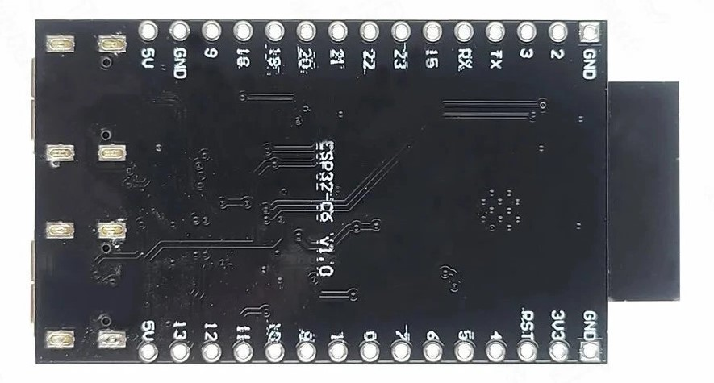
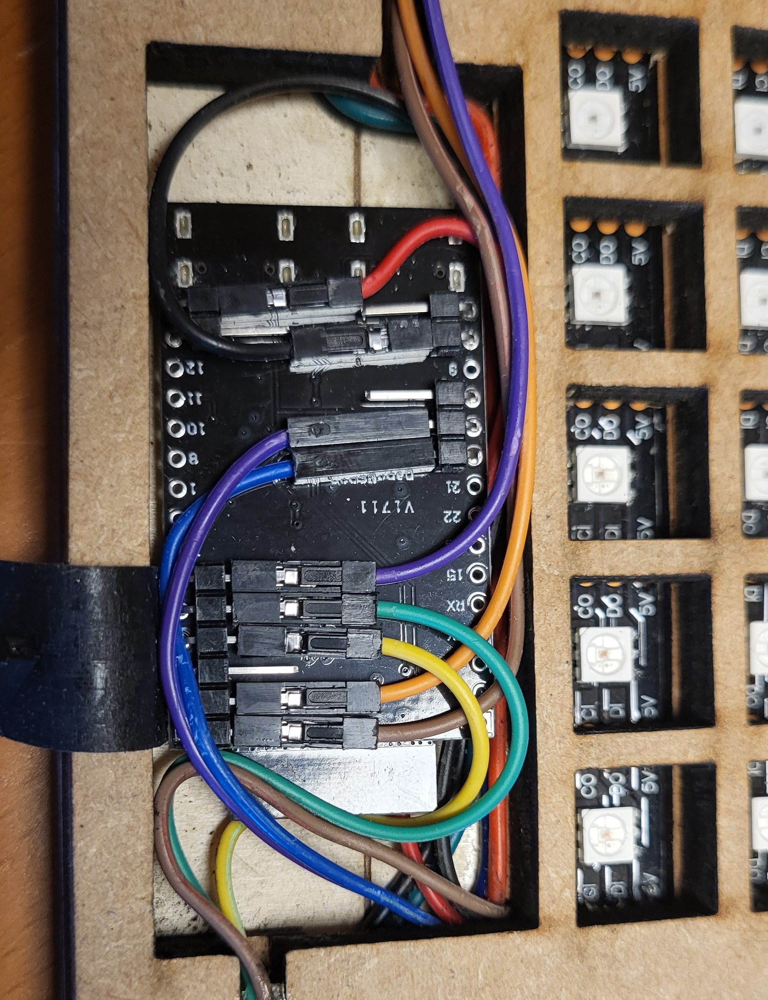
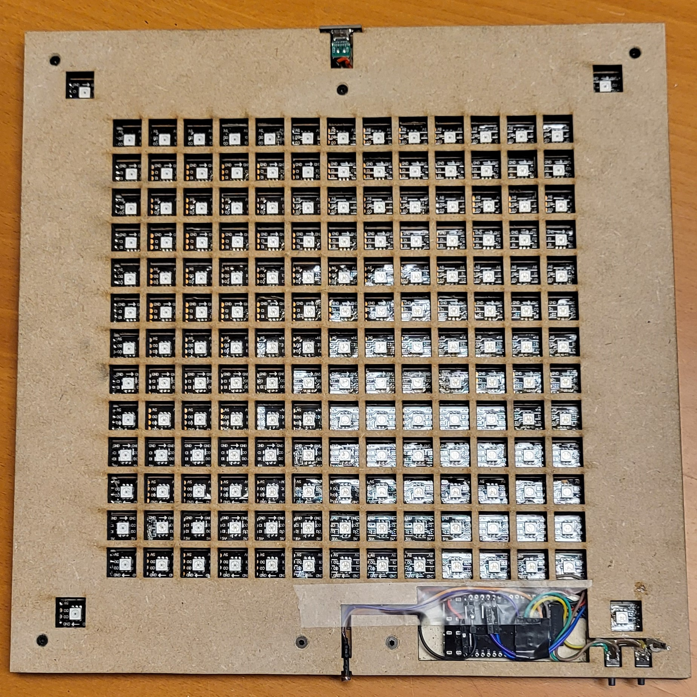

# Instructions

Instructions to build the clock.

## Groundwork

Start out with a square [ground layer](../design/ClockLayers%20v2%20layer1%20base6%202x300x100.svg), optionally with holes for small bolts to join the layers. Optionally burn the [guide lines](../design/ClockLayers%20v2%20layer1a%20base6%201x3000x20.svg) on this ground layer to correctly position the LEDs. Glue the [led layer](../design/ClockLayers%20v2%20layer2%20mdf2%201x400x100.svg) atop of it and make sure the lanes are straigh. You can use the cut out part for this, but make sure this part is not glued to the ground layer.

The result is something like this:

## Add LEDs

Cut the first section of the strip to form a row (13 LEDs). Always start in the upperleft corner with 'DI' or 'Data In' because that is where the controller will be connected. Remove the protective foil so that the adhesive strip can be used to put it in place. Use the center line to position the center LED. Sometimes the welded part enlarges the distance between LEDs. Either correct the welding or accept a little displacement.

The second section or row will be upside down, because you end with 'data out' which should be connected on the same side to 'data in'.

This hence and forth positioning is called 'serpentine'.

Position the last four LEDs in the corners while taking the direction of the data line into account. The order is: bottom right, bottom left, top left, top right.

The result is something like this:

## Wiring and cutting

Cut open the lane on the left side. This allows the wiring for the corner LEDs. Use preferrably different colors for power, ground, data and clock. Solder the corner LEDs like the image below. On the bottom side of the clock you need extra length for power and ground to weld the power connector in place. On the top side make sure the wires need to be placed at the side of the open space, otherwise the ESP won't fit. Glue down these wires to the wood.

Next wire the LED strips ground to ground, power to power, clock out to clock in, data out to data in.

For the ESP I used bended pin headers (male) and wires with pin headers (female). You can optionally directly solder the wires to the ESP. Cut the wires in the right length and attach the LED strips. Do not yet attach the light sensor and switches.

The result is something like this:

## Connecting the ESP

I use standard bend headers for connecting the ESP in combination with female jumper wires for DIY kits.

Place a header (A) of 6 on GND/3V3/RST/4/5/6.  
Place a header (B) of 2 on 13/5V.  
Place a header (C) of 6 on 5V/GND/9/18/19/20.

Connect a red wire to 5V on C and a black wire to GND on A. This powers the board. Connect the other side of these wires to the LED strip. Make sure you know how to position the board and use lengths accordingly. Initially I had the board flipped over the long side, but this is better for accessibility.

Pin 19 and 20 make up the clock and data. These need also be soldered to the LED strip. Best to use the same colors as used for connecting the parts of the LED strip (green for clock, blue for data).

The light sensor uses header A connected like: `3.3V - LDR - SENSOR - 4K7 - GND`. Orange represents 3V3, purple the data and brown ground. Connect as specified and use shrinking material or tape to isolate.

The yellow wire is connected to the switch for `select` and green for `next`. The switches should be connected to ground on the other terminal. On the picture, this is also a brown wire, which is connected to the LED strip.

Make sure all wires can be nicely placed flat enough for the placement of the control layer.

The layout of your ESP can be found online. For example:

The result is something like this:

## Control layer and front plate

Guide all wires for the ESP, switches and sensor though the large open section and make sure the control layer is placed flat on the LED layer. Fixate the three layers. For example, use bolts and nuts. Make sure the front is flat by sinking the bolt head in the wood. Drill very carefully.

Attach the ESP if you didn't already do that and use tape to make sure the front is flat. This takes some fitting, nudging and tweaking.

Test the clock, make sure it is working.

Optionally add the switches and the light sensor. 

Paint the front plate in the color of your choice. Black is safe and beautiful. Let it dry and lasercut it. Spray-glue the back and attach the tracing paper (this paper diffuses the light, you need it!).

The result is something like this:

## Frame

...
