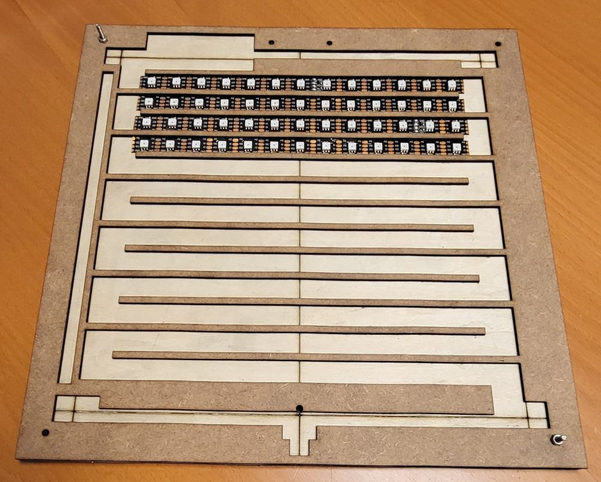
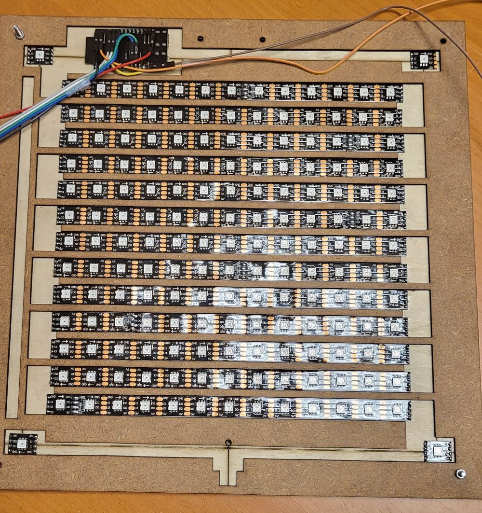
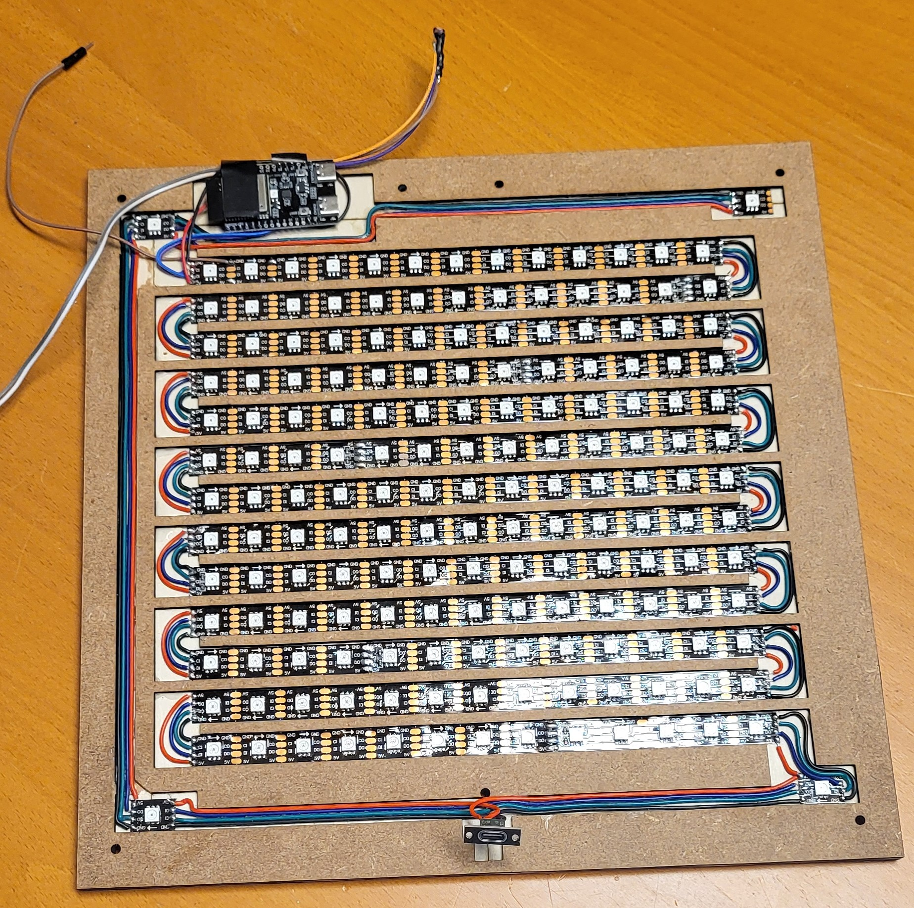

# Instructions

Instructions to build the clock.

## Groundwork

Start out with a square [ground layer](../design/ClockLayers v2 layer1 base6 2x300x100.svg), optionally with holes for small bolts to join the layers. Optionally burn the [guide lines](../design/ClockLayers v2 layer1a base6 1x3000x20.svg) on this ground layer to correctly position the LEDs. Glue the [led layer](../design/ClockLayers v2 layer2 mdf2 1x400x100.svg) atop of it and make sure the lanes are straigh. You can use the cut out part for this, but make sure this part is not glued to the ground layer.

The result is something like this:

## Add LEDs

Cut the first section of the strip to form a row (13 LEDs). Always start in the upperleft corner with 'DI' or 'Data In' because that is where the controller will be connected. Remove the protective foil so that the adhesive strip can be used to put it in place. Use the center line to position the center LED. Sometimes the welded part enlarges the distance between LEDs. Either correct the welding or accept a little displacement.

The second section or row will be upside down, because you end with 'data out' which should be connected on the same side to 'data in'.

This hence and forth positioning is called 'serpentine'.

Position the last four LEDs in the corners while taking the direction of the data line into account. The order is: bottom right, bottom left, top left, top right.

The result is something like this:

## Wiring and cutting

Cut open the lane on the left side. This allows the wiring for the corner LEDs. Use preferrably different colors for power, ground, data and clock. 

...

The result is something like this:

